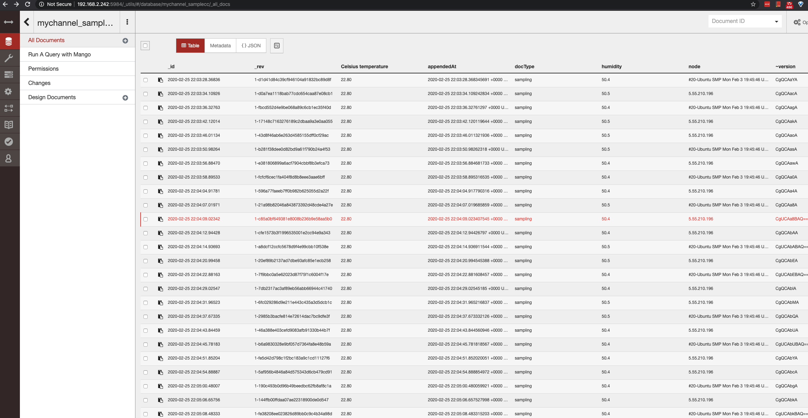

# Hyperledger Fabric Chaincode for 64-bit Raspberry-Pi4 and Pi3
Batteries included: utilize the prepared Fabric [Docker Images](https://hub.docker.com/r/blewater).

If you would rather build the Docker images yourself, I have you got you covered with a helpful, detailed Fabric v1.4.4 Docker Images [building guide for Ubuntu 19.10](buildfabric.md).

Sample temperature and humidity sensor readings with a Fabric smart contract on latest high performing Linux 64-bit arm64v8 kernel 5.3.0-1018-raspi2 aarch64 on Ubuntu 19.10

## Getting Started

You need the following gadgets:

* A Raspberry Pi4. Edition with 4Gig Ram. 
* A kit or separatedly case and power adaptor. 
* A breadboard
* 10+ [dupont wire 20cm male to female](https://www.amazon.com/EDGELEC-Breadboard-Optional-Assorted-Multicolored/dp/B07GD1XFWV/ref=sr_1_3?keywords=dupont+wire+20cm+male+to+female&qid=1582390213&sr=8-3)
* An HDMI monitor
* A plain keyboard, wireless preferred with mice included e.g. [Logitech](https://www.amazon.com/Logitech-920-004090-Wireless-Keyboard-K360/dp/B00822GICW/ref=pd_sbs_147_img_2/142-3858854-6761000?_encoding=UTF8&pd_rd_i=B00822GICW&pd_rd_r=c2c5a593-dd7d-49bc-824f-1c25a154702c&pd_rd_w=KqxJf&pd_rd_wg=6ABHf&pf_rd_p=5cfcfe89-300f-47d2-b1ad-a4e27203a02a&pf_rd_r=QC900D6VD4323GA75PH5&psc=1&refRID=QC900D6VD4323GA75PH5). Later you may utilize ssh.
* A standard ethernet cable. You may also utilize the embedded wifi adapter with great results in Ubuntu.
A high performing [SD card with at least 32Gig](https://www.amazon.com/SanDisk-64GB-Extreme-UHS-I-SDSDXXY-064G-GN4IN/dp/B07H9J1YXN/ref=sr_1_3?crid=3T9H0M95H6N0B&keywords=sd+card+64gb&qid=1582390672&sprefix=sd+card%2Caps%2C308&sr=8-3).


Follow the instructions to [install \*64bit Ubuntu 19.10.](https://ubuntu.com/download/raspberry-pi/thank-you?version=19.10.1&architecture=arm64+raspi3)
*Please note Hyperledger Fabric requires 64bit OS which excludes the Raspbian OS.

Login to Ubuntu:

  user: ubuntu
  
  pwd: ubuntu
*You will be forced to change your password* :)

### Software updates (when applicable we will use snap to speed up lthe installation process)
* Ubuntu updates
Refer to answers https://askubuntu.com/questions/196768/how-to-install-updates-via-command-line

* sudo reboot

* login

* run uname -a

*(at the time of this writeup the latest Linux ARM kernel is 5.3.0-1018-raspi2)*

* Optionally, you may follow a Ubuntu guide to set a statip IP address and SSH access by public key. 

Refer to /etc/netplan apply, ssh-copy-id
  
* Install **docker** Run these commands:
```
sudo snap install docker

sudo groupadd docker

sudo usermod -aG docker ${USER}

logout

login

docker run hello-world 
# should download and run the hello-world image without requiring sudo access

docker-compose version
# displays version 1.23.2+
```
* install go language compiler/linker binaries
```
sudo snap install --channel=1.11/stable go --classic

nano ~/.bashrc

# add the following last line
export GOPATH=~/go

# save & exit
source ~/.bashrc

# retrieve the golang chaincode shim useful later
go get -u github.com/hyperledger/fabric/core/chaincode/shim

# sync your user's path to sudo
# you will need this for sampling data
echo $PATH

# copy the value
# sudo visudo 
# append the path value within the secure path
# value with : upfront
# test go in sudo mode
# Demo from my Pi
 echo $PATH

/home/p/.nvm/versions/node/v8.17.0/bin:/usr/local/sbin:/usr/local/bin:/usr/sbin:/usr/bin:/sbin:/bin:/usr/games:/usr/local/games:/snap/bin:/usr/local/go/bin
p@masterpi:~/go/src/github.com/hyperledger/pifabric$ sudo visudo
p@masterpi:~/go/src/github.com/hyperledger/pifabric$ sudo go version
go version go1.11.13 linux/arm64
p@masterpi:~/go/src/github.com/hyperledger/pifabric$
```

### Getting Ready to work with Fabric
```
mkdir -p ~/go/src/github.com/hyperledger/
cd ~/go/src/github.com/hyperledger/

# download the repo of this page
git clone https://github.com/blewater/pifabric

# retrieve the fabric-samples we will work with
git clone https://github.com/hyperledger/fabric-samples

# retrieve the chaincode shim useful later
go get -u github.com/hyperledger/fabric/core/chaincode/shim

# download raspberrypi Docker images
cd pifabric
./get-images.sh

# check images for a similar result as this
docker images
REPOSITORY                     TAG                         IMAGE ID            CREATED             SIZE
blewater/fabric-ca             latest                      1f5796cac18c        19 hours ago        177MB
hyperledger/fabric-ca          latest                      1f5796cac18c        19 hours ago        177MB
blewater/fabric-tools          latest                      f82fe2f8d301        20 hours ago        1.49GB
hyperledger/fabric-tools       latest                      f82fe2f8d301        20 hours ago        1.49GB
blewater/fabric-buildenv       latest                      1d0ccc3dfc1a        20 hours ago        1.43GB
hyperledger/fabric-buildenv    latest                      1d0ccc3dfc1a        20 hours ago        1.43GB
blewater/fabric-ccenv          latest                      968779ee5bb2        20 hours ago        1.4GB
hyperledger/fabric-ccenv       latest                      968779ee5bb2        20 hours ago        1.4GB
blewater/fabric-orderer        latest                      76e57fc8518c        20 hours ago        111MB
hyperledger/fabric-orderer     latest                      76e57fc8518c        20 hours ago        111MB
blewater/fabric-peer           latest                      9b02746c9cf4        20 hours ago        118MB
hyperledger/fabric-peer        latest                      9b02746c9cf4        20 hours ago        118MB
blewater/fabric-zookeeper      latest                      969207ec1a59        21 hours ago        497MB
hyperledger/fabric-zookeeper   latest                      969207ec1a59        21 hours ago        497MB
blewater/fabric-kafka          latest                      3819183d7baa        21 hours ago        491MB
hyperledger/fabric-kafka       latest                      3819183d7baa        21 hours ago        491MB
blewater/fabric-couchdb        latest                      16dd2c814964        21 hours ago        246MB
hyperledger/fabric-couchdb     latest                      16dd2c814964        21 hours ago        246MB
blewater/fabric-baseimage      latest                      fd1c6de7680f        22 hours ago        1.34GB
hyperledger/fabric-baseimage   latest                      fd1c6de7680f        22 hours ago        1.34GB
blewater/fabric-baseos         latest                      2954a8577995        24 hours ago        78.6MB
hyperledger/fabric-baseos      latest                      2954a8577995        24 hours ago        78.6MB

# now copy Fabric raspberry binaries built in the fabric-tools Docker image
# ease they are also included in this repo
chmod +x ./bin/*
chmod +x *.sh
sudo cp ./bin/* /usr/local/bin
```

### Start an one organization network blockchain
```
cd ../fabric-samples/basic-network

# generate static cryptographic material
./generate.sh

# a successful invocation should output this
2020-02-23 21:06:20.537 UTC [common.tools.configtxgen] main -> INFO 001 Loading configuration
2020-02-23 21:06:20.544 UTC [common.tools.configtxgen.localconfig] Load -> INFO 002 Loaded configuration: /home/p/go/src/github.com/hyperledger/fabric-samples/basic-network/configtx.yaml
2020-02-23 21:06:20.550 UTC [common.tools.configtxgen.localconfig] completeInitialization -> INFO 003 orderer type: solo
2020-02-23 21:06:20.550 UTC [common.tools.configtxgen.localconfig] LoadTopLevel -> INFO 004 Loaded configuration: /home/p/go/src/github.com/hyperledger/fabric-samples/basic-network/configtx.yaml
2020-02-23 21:06:20.550 UTC [common.tools.configtxgen] doOutputAnchorPeersUpdate -> INFO 005 Generating anchor peer update
2020-02-23 21:06:20.550 UTC [common.tools.configtxgen] doOutputAnchorPeersUpdate -> INFO 006 Writing anchor peer update

# now start the network
./start.sh

# check for the final result of joining a channel

Creating network "net_basic" with the default driver
Creating orderer.example.com ... done
Creating ca.example.com      ... done
Creating couchdb             ... done
Creating peer0.org1.example.com ... done
docker ps -a
CONTAINER ID        IMAGE                        COMMAND                  CREATED             STATUS                     PORTS                                            NAMES
28cbda73124c        hyperledger/fabric-peer      "peer node start"        4 seconds ago       Up Less than a second      0.0.0.0:7051->7051/tcp, 0.0.0.0:7053->7053/tcp   peer0.org1.example.com
db02bf6cc6c7        hyperledger/fabric-couchdb   "tini -- /docker-ent…"   8 seconds ago       Up 3 seconds               4369/tcp, 9100/tcp, 0.0.0.0:5984->5984/tcp       couchdb
bf4b1e70900e        hyperledger/fabric-ca        "sh -c 'fabric-ca-se…"   8 seconds ago       Exited (1) 2 seconds ago                                                    ca.example.com
f3622bdd58f6        hyperledger/fabric-orderer   "orderer"                8 seconds ago       Up 4 seconds               0.0.0.0:7050->7050/tcp                           orderer.example.com

# wait for Hyperledger Fabric to start
# incase of errors when running later commands, issue export FABRIC_START_TIMEOUT=<larger number>
export FABRIC_START_TIMEOUT=10
#echo ${FABRIC_START_TIMEOUT}
sleep ${FABRIC_START_TIMEOUT}

# Create the channel
docker exec -e "CORE_PEER_LOCALMSPID=Org1MSP" -e "CORE_PEER_MSPCONFIGPATH=/etc/hyperledger/msp/users/Admin@org1.example.com/msp" peer0.org1.example.com peer channel create -o orderer.example.com:7050 -c mychannel -f /etc/hyperledger/configtx/channel.tx
2020-02-23 21:12:25.431 UTC [channelCmd] InitCmdFactory -> INFO 001 Endorser and orderer connections initialized
2020-02-23 21:12:25.534 UTC [cli.common] readBlock -> INFO 002 Received block: 0
# Join peer0.org1.example.com to the channel.
docker exec -e "CORE_PEER_LOCALMSPID=Org1MSP" -e "CORE_PEER_MSPCONFIGPATH=/etc/hyperledger/msp/users/Admin@org1.example.com/msp" peer0.org1.example.com peer channel join -b mychannel.block
2020-02-23 21:12:26.326 UTC [channelCmd] InitCmdFactory -> INFO 001 Endorser and orderer connections initialized
2020-02-23 21:12:26.712 UTC [channelCmd] executeJoin -> INFO 002 Successfully submitted proposal to join channel
```

### Groundwork for the chaincode run
```
# launch the fabric-tools container for chaincode interaction
docker-compose up -d cli
# look for "Creating cli ... done"
```

### Install a C DHT22 raspberry lib
#### Ref http://www.airspayce.com/mikem/bcm2835/
```
cd ../../pifabric

tar zxvf bcm2835-1.62.tar.gz

cd bcm2835-1.62

./configure

make
# make sure the check returns good results 
sudo make check

PASS: test
============================================================================
Testsuite summary for bcm2835 1.62
============================================================================
# TOTAL: 1
# PASS:  1
# SKIP:  0
# XFAIL: 0
# FAIL:  0
# XPASS: 0
# ERROR: 0
============================================================================

sudo make install

Making install in src
make[1]: Entering directory '/home/p/unic/bcm2835-1.62/src'
make[2]: Entering directory '/home/p/unic/bcm2835-1.62/src'
 /usr/bin/mkdir -p '/usr/local/lib'
 /usr/bin/install -c -m 644  libbcm2835.a '/usr/local/lib'
 ( cd '/usr/local/lib' && ranlib libbcm2835.a )
 /usr/bin/mkdir -p '/usr/local/include'
 /usr/bin/install -c -m 644 bcm2835.h '/usr/local/include'
make[2]: Leaving directory '/home/p/unic/bcm2835-1.62/src'
make[1]: Leaving directory '/home/p/unic/bcm2835-1.62/src'
Making install in doc
make[1]: Entering directory '/home/p/unic/bcm2835-1.62/doc'
make[2]: Entering directory '/home/p/unic/bcm2835-1.62/doc'
make[2]: Nothing to be done for 'install-exec-am'.
make[2]: Nothing to be done for 'install-data-am'.
make[2]: Leaving directory '/home/p/unic/bcm2835-1.62/doc'
make[1]: Leaving directory '/home/p/unic/bcm2835-1.62/doc'
make[1]: Entering directory '/home/p/unic/bcm2835-1.62'
make[2]: Entering directory '/home/p/unic/bcm2835-1.62'
make[2]: Nothing to be done for 'install-exec-am'.
make[2]: Nothing to be done for 'install-data-am'.
make[2]: Leaving directory '/home/p/unic/bcm2835-1.62'
make[1]: Leaving directory '/home/p/unic/bcm2835-1.62'

# now we are ready to install the go wrapper
go get -u github.com/gerp/dht22
# github.com/gerp/dht22
In file included from /usr/include/aarch64-linux-gnu/bits/libc-header-start.h:33,
                 from /usr/include/stdlib.h:25,
                 from _cgo_export.c:3:
/usr/include/features.h:185:3: warning: #warning "_BSD_SOURCE and _SVID_SOURCE are deprecated, use _DEFAULT_SOURCE" [-Wcpp]
  185 | # warning "_BSD_SOURCE and _SVID_SOURCE are deprecated, use _DEFAULT_SOURCE"
      |   ^~~~~~~
# github.com/gerp/dht22
In file included from /usr/include/aarch64-linux-gnu/bits/libc-header-start.h:33,
                 from /usr/include/stdlib.h:25,
                 from _cgo_export.c:3:
/usr/include/features.h:185:3: warning: #warning "_BSD_SOURCE and _SVID_SOURCE are deprecated, use _DEFAULT_SOURCE" [-Wcpp]
  185 | # warning "_BSD_SOURCE and _SVID_SOURCE are deprecated, use _DEFAULT_SOURCE"
      |   ^~~~~~~
# github.com/gerp/dht22
In file included from /usr/include/errno.h:25,
                 from cgo-gcc-prolog:28:
/usr/include/features.h:185:3: warning: #warning "_BSD_SOURCE and _SVID_SOURCE are deprecated, use _DEFAULT_SOURCE" [-Wcpp]
  185 | # warning "_BSD_SOURCE and _SVID_SOURCE are deprecated, use _DEFAULT_SOURCE"
      |   ^~~~~~~
# github.com/gerp/dht22
In file included from /usr/include/aarch64-linux-gnu/bits/libc-header-start.h:33,
                 from /usr/include/stdio.h:27,
                 from dht22.c:1:
/usr/include/features.h:185:3: warning: #warning "_BSD_SOURCE and _SVID_SOURCE are deprecated, use _DEFAULT_SOURCE" [-Wcpp]
  185 | # warning "_BSD_SOURCE and _SVID_SOURCE are deprecated, use _DEFAULT_SOURCE"
      |   ^~~~~~~

# test our sample program
cd ../
sudo -E go run sample.go

# if successful results in 
Temperature: 25.3C, Humidity: 40.9%
```

### Getting to the chaincodes
```
# copy chaincode into peer bound chaincode folder
cp -R ./samplecc ../fabric-samples/chaincode/

# go to the source cc folder
cd ../fabric-samples/chaincode/samplecc/

# test build
go build 

# no news is good news :)
```

### Run the chaincode
```
# back to pifabric folder
cd ../../../pifabric

# * Run Once *
# install chaincode
# Two options
# run this and note the version value -v 0 zero in this case
docker exec cli peer chaincode install -n samplecc -v 0 -p github.com/samplecc

# or this
./1.installcc.sh

# a successful installation result
2020-02-25 02:44:51.088 UTC [chaincodeCmd] checkChaincodeCmdParams -> INFO 001 Using default escc
2020-02-25 02:44:51.088 UTC [chaincodeCmd] checkChaincodeCmdParams -> INFO 002 Using default vscc
2020-02-25 02:44:51.859 UTC [chaincodeCmd] install -> INFO 003 Installed remotely response:<status:200 payload:"OK" >

# * Run Once *
* invoke chaincode
# requires priviledged sudo access for accessing 
# the sensor functions to initiate the chaincode
# it also saves the first sampling in the ledger
./2.initcc.sh

# Run as many times as needed
# sample the sensor temp in Celsius and humidity %
# append to the ledger
./3.invokecc.sh

x.x.x.x, 22.50,51.60
^[34m2020-02-25 19:22:55.636 UTC [chaincodeCmd] InitCmdFactory -> INFO 001^[0m Retrieved channel (mychannel) o
rderer endpoint: orderer.example.com:7050
^[34m2020-02-25 19:22:55.648 UTC [chaincodeCmd] chaincodeInvokeOrQuery -> INFO 002^[0m Chaincode invoke succes
sful. result: status:200

# use watch to get a few samplings
watch -n 5 ./3.invokecc.sh

Every 5.0s: ./3.invokecc.sh                                                   ubuntu: Tue Feb 25 19:24:11 2020

x.x.x.x, 22.50,51.50
^[34m2020-02-25 19:24:14.465 UTC [chaincodeCmd] InitCmdFactory -> INFO 001^[0m Retrieved channel (mychannel) o
rderer endpoint: orderer.example.com:7050
^[34m2020-02-25 19:24:14.477 UTC [chaincodeCmd] chaincodeInvokeOrQuery -> INFO 002^[0m Chaincode invoke succes
sful. result: status:200

# access results from the couchdb instance
# from any browser within the same access subnet
# run and select the eth0 or wifi 
ip r

default via 192.168.2.1 dev eth0 proto static
172.17.0.0/16 dev docker0 proto kernel scope link src 172.17.0.1 linkdown
172.27.0.0/16 dev br-32a73e9a7d3b proto kernel scope link src 172.27.0.1
192.168.2.0/24 dev eth0 proto kernel scope link src 192.168.2.242

# in this case it's the 192.168.2.242 and 5984
# the port also shows when executing docker ps and checking out the docker port
```
#### http://192.168.2.242:5984/_utils/
click on 
**mychannel_samplecc**
the ledger for the mychannel to view the saved readings

You may explore more with the [Fabric tutorials for chaincode development](https://hyperledger-fabric.readthedocs.io/en/release-1.4/tutorials.html)

#### 4 chaincode invoking processes in a single Pi4 4Gg Ram edition

Launched 4 [watch](https://linux.die.net/man/1/watch) processes each invoking the samplecc chaincode with sensor readings every 5, 7, 10 and 20 seconds appears to put no pressure on the latest Pi rendition. 

Granted that this is among the simplest blockchain offerings, it is still no small feat for a $65 board to pull through with a low cpu energy profile. The is the  basic network--a single organization blockchain with a single peer, orderer, transaction endorser and couchdb ledger database featuring the simplistic Solo consensus algorithm all runnning in docker containers. All portrayed sessions are employing ssh. In fact, it appears that the single sensor interface contention among the 4 processes appears to consume the most cpu resources.
  
 #### How can you view the accumulated ledger data?
 
 Hyperledger Fabric offers the CouchDB document database (besides other lesser sophisticated options) for all its ledger (world state) and private data collections. Looking at the Pi's couchDb exposed port at 5984 the channe's ledger is actual document collection.You may choose among 3 viewing options: List, Metadata and Json i.e., shown here
 
 #### IoT Blockchain Data Analytics.
 
 By offering easy data export, Hyperledger Fabric offers a no-hassle data-friendly IoT blockchain platform. The data can easily be exported in json format for later machine-learning platforms ingestion. While this exercise, did not demonstrate Fabric's chaincode query capabilities, one may view documentation for performing simple state or richer document based queries.
 
 

