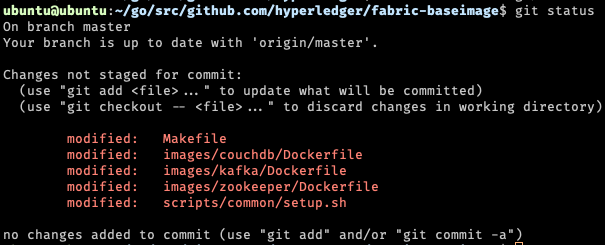

# Optional Building the Hyperledger Fabric Images for 64-bit ARM devices
Please note these images are already available at [Docker Images](https://hub.docker.com/r/blewater).

For the general Fabric setup guide for RaspberryPi4 is [here](README.md)

## Getting Started

* clone the Fabric code base
```
mkdir -p ~/go/src/github.com/hyperledger/

cd ~/go/src/github.com/hyperledger/

git clone https://github.com/hyperledger/fabric
git clone https://github.com/hyperledger/fabric-samples
git clone https://github.com/hyperledger/fabric-baseimage
git clone https://github.com/hyperledger/fabric-chaincode-go

```

## Building the base images (couchdb, kakfa, zookeeper)

```
sudo apt install make #install make

# install this guide's ARM patch
git clone https://github.com/blewater/pifabric

# patch fabric-baseimage with ARM64 changes
cp -r ./pifabric/fabric-baseimage/* ./fabric-baseimage/

cd fabric-baseimage

git status 
# should display the following patched changes
```


nano Makefile
on line 78,79 enter your dockerhub credentials

    --username=blewater \
    --password=xxxxxxxxxx \

### Start the lenghthy build process

```
make all
```


